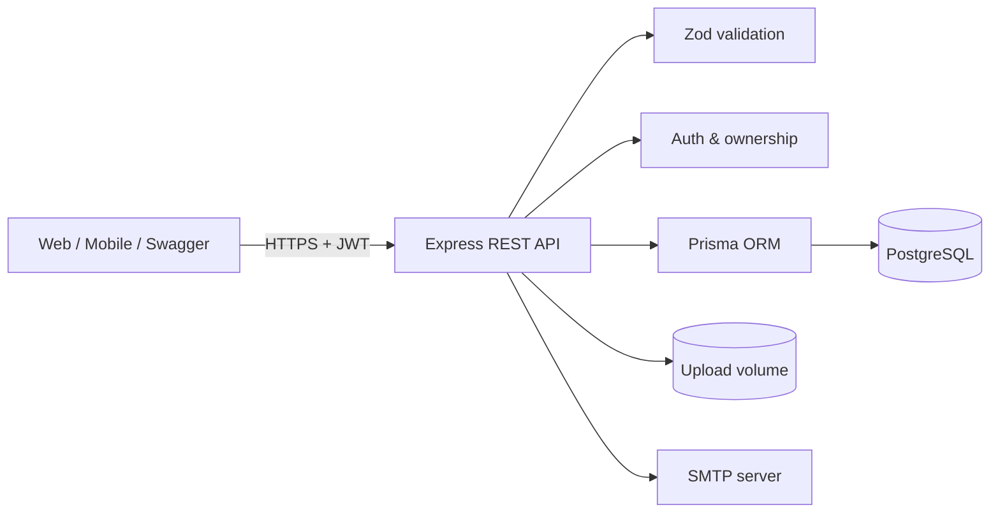
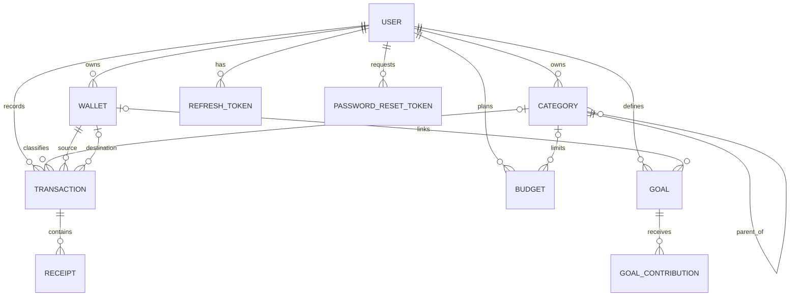

# Tài liệu thiết kế hệ thống sổ thu chi cá nhân

## 1. Mục tiêu và phạm vi

Hệ thống cung cấp API backend đa người dùng để ghi nhận thu, chi và chuyển khoản; theo dõi số dư ví, ngân sách, mục tiêu; xuất dữ liệu và đối soát. Mỗi tài nguyên nghiệp vụ thuộc đúng một người dùng. Phiên bản này không có vai trò quản trị vì phạm vi bài toán là sổ cá nhân; phân quyền được thực hiện theo xác thực và quyền sở hữu tài nguyên.

## 2. Kiến trúc

Ứng dụng là modular monolith. Cách này giảm chi phí vận hành trong giai đoạn đào tạo, vẫn tách module đủ rõ để mở rộng. API không lưu session trong bộ nhớ; refresh token băm SHA-256 được lưu ở PostgreSQL nên có thể chạy nhiều instance sau load balancer. Hóa đơn được lưu trên volume; khi triển khai nhiều instance nên thay bằng S3/MinIO.

## 3. Mô hình dữ liệu

Các quyết định chính:

- Số tiền dùng `DECIMAL(19,4)`, không dùng floating-point trong cơ sở dữ liệu.
- Số dư ví không lưu lặp; được tính từ số dư đầu kỳ cộng thu, trừ chi, cộng/trừ chuyển khoản. Nhờ đó báo cáo đối soát có một nguồn dữ liệu chuẩn.
- Danh mục hỗ trợ cây bằng khóa ngoại tự tham chiếu. API ngăn tự tham chiếu, vòng lặp và không cho cha/con khác loại.
- Xóa ví là soft delete (`archived_at`) để giữ lịch sử. Danh mục đang được tham chiếu không được xóa. Xóa giao dịch sẽ xóa metadata và tệp hóa đơn.
- Giao dịch chuyển khoản dùng một bản ghi với ví nguồn và ví đích để tránh hai vế bị lệch.
- Constraint SQL bảo vệ số tiền dương, khoảng ngày và tính hợp lệ cơ bản của chuyển khoản ngay cả khi dữ liệu không đi qua API.

## 4. Luồng xác thực

1. Đăng ký băm mật khẩu bằng bcrypt cost 12, tạo ví tiền mặt và danh mục mặc định.
2. Đăng nhập cấp access token 15 phút và refresh token 7 ngày.
3. Mỗi lần refresh, token cũ bị thu hồi và token mới được tạo (rotation).
4. Đăng xuất thu hồi refresh token đã gửi.
5. Quên mật khẩu luôn trả cùng một thông báo để tránh dò tài khoản. Token reset ngẫu nhiên 256 bit, chỉ lưu hash và hết hạn mặc định sau 15 phút.
6. Đổi hoặc reset mật khẩu thu hồi mọi refresh token đang hoạt động.

Access token mang `sub`, `username`, `type`. Mọi truy vấn tài nguyên luôn kèm `userId` từ token; UUID do client gửi không đủ để truy cập dữ liệu người khác.

## 5. Quy tắc nghiệp vụ

### Ví và giao dịch

- Ví đã lưu trữ không nhận giao dịch mới nhưng vẫn xuất hiện trong báo cáo đối soát.
- Ví nguồn/đích chuyển khoản phải cùng chủ sở hữu, khác nhau và cùng tiền tệ.
- Danh mục thu chỉ gắn giao dịch thu; danh mục chi chỉ gắn giao dịch chi; chuyển khoản không có danh mục.
- Danh sách giao dịch hỗ trợ lọc ví, danh mục, loại, thời gian, từ khóa và phân trang tối đa 100 bản ghi.

### Ngân sách

- Ngân sách có ngày bắt đầu/kết thúc và số tiền dương.
- Có thể áp dụng cho một danh mục chi hoặc toàn bộ chi tiêu.
- `spent`, `remaining`, `percentUsed` được tính trực tiếp từ giao dịch trong kỳ.

### Mục tiêu

- Đóng góp dương làm tăng, số âm điều chỉnh giảm nhưng tổng không được âm.
- Khi số tiền hiện tại đạt mục tiêu, trạng thái tự chuyển `COMPLETED`; điều chỉnh xuống dưới mục tiêu chuyển lại `ACTIVE`.
- Mục tiêu `CANCELLED` không nhận đóng góp mới.

### Báo cáo và đối soát

- Báo cáo tổng hợp trả tổng thu, tổng chi, dòng tiền ròng, chi theo danh mục và theo tháng.
- Đối soát trả số dư tính toán từng ví và tổng theo từng mã tiền tệ; không cộng gộp các tiền tệ khác nhau.
- CSV dùng UTF-8 BOM để mở đúng tiếng Việt trong Excel và escape theo RFC 4180.

### Hướng dẫn người dùng mới

- Bốn bước cốt lõi gồm hồ sơ, ví, danh mục và giao dịch đầu tiên. Tiến độ được suy ra từ dữ liệu thật; trạng thái chỉ lưu việc đã xem hoặc tạm ẩn trong `User.preferences`, nên không cần migration mới.
- Đăng ký thường và OAuth không tự tạo dữ liệu tài chính. Bộ danh mục gợi ý chỉ được tạo sau khi người dùng đồng ý; thao tác từ Agent vẫn phải qua bản xem trước và xác nhận.
- UI có hộp chào mừng, checklist dashboard, trạng thái rỗng có hành động, trung tâm trợ giúp và khả năng tiếp tục/mở lại. Agent dùng cùng trạng thái, nhận `currentView` và trả `uiActions` để dẫn đến đúng màn hình.

## 6. Thiết kế API và lỗi

Base path là `/api/v1`; tài liệu tương tác ở `/api-docs`. Response thành công và lỗi dùng envelope thống nhất. Validation trả HTTP 422; chưa xác thực 401; không có quyền 403; không tìm thấy 404; xung đột 409; lỗi ngoài dự kiến 500. Chi tiết exception nội bộ không bị trả cho client.

OpenAPI 3.0 mô tả endpoint, input, auth và response dùng chung. Health endpoint tách khỏi base path để container/orchestrator kiểm tra.

## 7. An toàn và vận hành

- Helmet đặt security header; CORS chỉ cho các origin cấu hình.
- JSON giới hạn 1 MB. Hóa đơn giới hạn dung lượng, whitelist MIME và đổi tên UUID.
- Mật khẩu và token reset/refresh không lưu dạng rõ.
- Image Docker chạy bằng user không phải root.
- Secret trong `docker-compose.yml` chỉ dành cho local; production phải cấp từ secret manager.
- Nên bổ sung rate limit ở API gateway, quét malware cho hóa đơn, audit log và mã hóa backup trước khi production thật.

## 8. Migration, kiểm thử và CI

Migration đầu tiên tạo toàn bộ enum, bảng, index, foreign key và check constraint. Production dùng `prisma migrate deploy`; không dùng `db push` vì không có lịch sử thay đổi.

Unit test tập trung vào logic nhạy cảm: tính số dư, cây danh mục, CSV, JWT, validation, response và exception. Coverage có ngưỡng 80% cho lớp tiện ích/middleware. Bộ E2E chạy trên PostgreSQL thật bao phủ auth, ownership, CRUD nghiệp vụ, CSV, hóa đơn, ngân sách, mục tiêu và báo cáo; bộ test tạo tài khoản riêng và tự dọn sau khi kết thúc.

GitHub Actions chạy generate Prisma, build và test cho pull request/push vào `main`. Docker Compose khởi động PostgreSQL có healthcheck, sau đó API tự chạy migration.

## 9. Hướng mở rộng

- Hỗ trợ tỷ giá và snapshot số dư để tối ưu tài khoản có hàng triệu giao dịch.
- Giao dịch định kỳ, thông báo vượt ngân sách, chia sẻ ví gia đình và RBAC.
- Object storage cho hóa đơn, OCR và hàng đợi xử lý nền.
- MFA, xác minh email/điện thoại, khóa đăng nhập và rate limiting phân tán.
- Audit trail bất biến và quy trình khôi phục dữ liệu.
