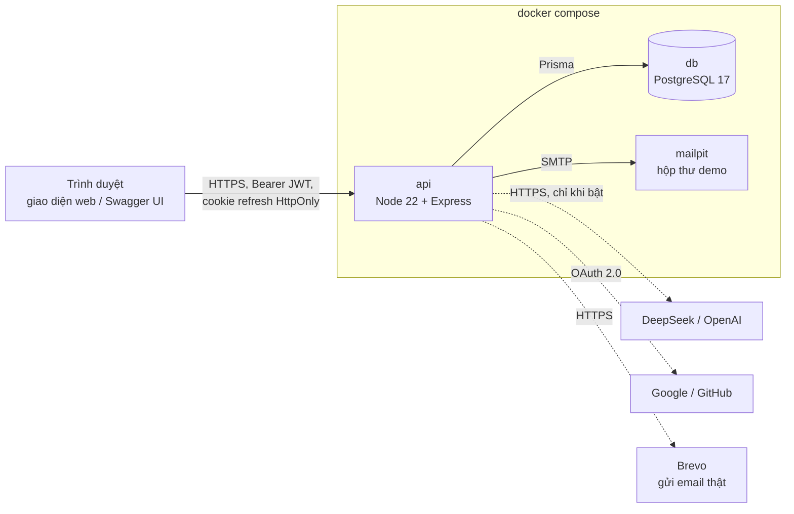
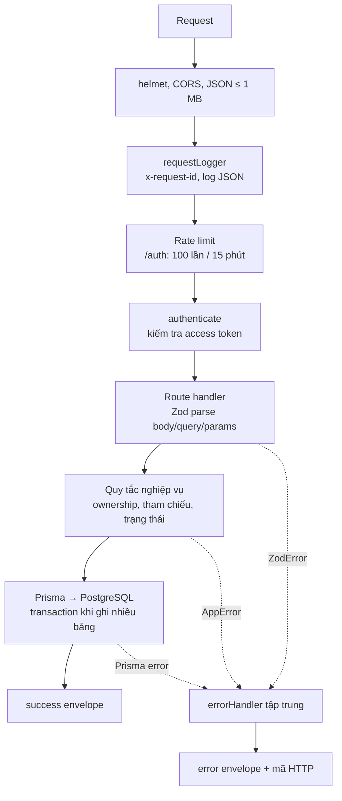
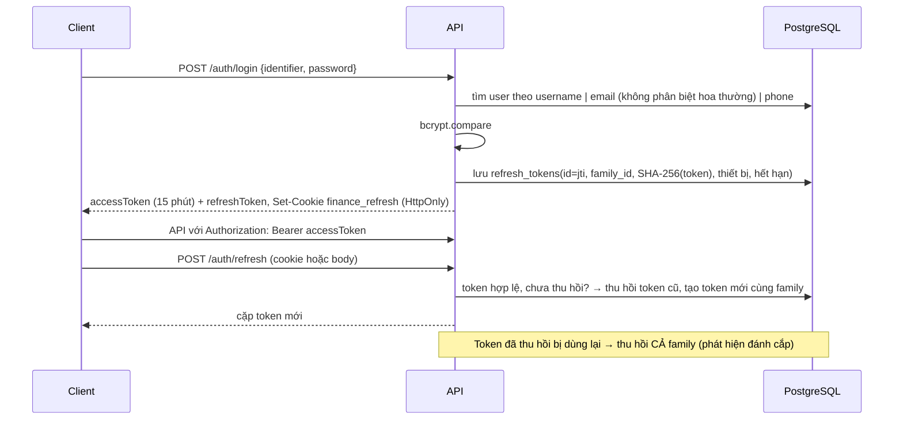

# Tài liệu thiết kế hệ thống Sổ Mộc — sổ thu chi cá nhân

| Mục                | Nội dung                                                                                                                                                              |
| ------------------ | --------------------------------------------------------------------------------------------------------------------------------------------------------------------- |
| Phạm vi            | Backend REST quản lý thu chi cá nhân (TASK_00030), kèm giao diện web và Agent AI                                                                                      |
| Công nghệ          | Node.js 22, TypeScript 5.9, Express 4, Prisma 6, PostgreSQL 17, Zod 3                                                                                                 |
| Tài liệu liên quan | [README](../README.md) (cài đặt, cấu hình), [Thiết kế Agent](THIET_KE_AGENT_THONG_MINH.md), [SRS Onboarding & Agent](SRS_ONBOARDING_AGENT.md), Swagger UI `/api-docs` |

## 1. Mục tiêu và phạm vi

Hệ thống cho phép mỗi người dùng ghi nhận thu, chi và chuyển khoản giữa các ví; theo dõi số dư, ngân sách và mục tiêu tiết kiệm; xuất CSV, đính kèm hóa đơn và đối soát số dư. Mọi tài nguyên nghiệp vụ thuộc đúng một người dùng. Phân quyền dựa trên xác thực (JWT) và quyền sở hữu tài nguyên: mọi truy vấn đều kèm `userId` lấy từ token, nên UUID do client gửi không đủ để đọc hay sửa dữ liệu người khác (trả 404, không tiết lộ tài nguyên có tồn tại).

Đối chiếu yêu cầu nghiệp vụ của đề bài:

| Yêu cầu                                                               | Thiết kế đáp ứng     | Module                                                    |
| --------------------------------------------------------------------- | -------------------- | --------------------------------------------------------- |
| Đăng ký bằng định danh + mật khẩu, đăng nhập/đăng xuất                | Mục 4.1–4.2          | `routes/auth.routes.ts`                                   |
| Xem, cập nhật hồ sơ                                                   | `GET/PATCH /profile` | `routes/profile.routes.ts`                                |
| Đổi mật khẩu, quên mật khẩu (đề bài: qua SMS hoặc Email — chọn Email) | Mục 4.3              | `routes/auth.routes.ts`, `services/mail.service.ts`       |
| Danh mục phẳng hoặc cây                                               | Mục 5.2              | `routes/category.routes.ts`, `lib/category-tree.ts`       |
| Quản lý ví                                                            | Mục 5.1              | `routes/wallet.routes.ts`                                 |
| Ghi giao dịch, danh sách, chi tiết                                    | Mục 5.3              | `routes/transaction.routes.ts`                            |
| Xuất CSV, upload hóa đơn                                              | Mục 5.3, 5.6         | `routes/transaction.routes.ts`, `routes/report.routes.ts` |
| Ngân sách, mục tiêu                                                   | Mục 5.4, 5.5         | `routes/budget.routes.ts`, `routes/goal.routes.ts`        |
| Báo cáo đối soát                                                      | Mục 5.6              | `routes/report.routes.ts`                                 |
| Response thống nhất, xử lý lỗi tập trung                              | Mục 6                | `lib/response.ts`, `middleware/error-handler.ts`          |
| Tài liệu API tự sinh                                                  | Mục 6.3              | `docs/openapi.ts`, `docs/route-docs.ts`                   |
| Migration, đóng gói                                                   | Mục 8, 9             | `prisma/migrations`, `Dockerfile`, `docker-compose.yml`   |

Ngoài phạm vi bắt buộc, hệ thống có thêm: OAuth Google/GitHub, quản lý thiết bị đăng nhập, nhãn, merchant, chia giao dịch, giao dịch định kỳ, hóa đơn nhắc việc, quy tắc tự phân loại, thông báo, nhóm gia đình, tỷ giá, audit log, onboarding và Agent AI.

## 2. Kiến trúc

### 2.1 Thành phần triển khai



- **api**: một tiến trình Node phục vụ cả REST API (`/api/v1`), tài liệu (`/api-docs`), health check (`/health`) và giao diện tĩnh (`public/`). Không giữ trạng thái phiên trong bộ nhớ: refresh token được lưu băm trong PostgreSQL, hóa đơn lưu dạng nhị phân trong bảng `receipts`. Vì vậy có thể chạy nhiều instance sau load balancer. Riêng bộ đếm rate limit nằm trong bộ nhớ từng instance; khi scale ngang nên chuyển sang Redis hoặc API gateway.
- **db**: PostgreSQL có healthcheck; `api` chỉ khởi động sau khi db healthy.
- **mailpit**: nhận mọi email hệ thống ở môi trường demo (xem tại cổng 8025). Production thay bằng SMTP thật qua biến `SMTP_*`.
- Dịch vụ ngoài (AI, OAuth) là tùy chọn: thiếu cấu hình thì các chức năng khác vẫn chạy đầy đủ.

### 2.2 Phân lớp trong ứng dụng

Ứng dụng là **modular monolith**: mỗi nghiệp vụ là một router Express độc lập, dùng chung lớp tiện ích và middleware.



| Đường dẫn          | Trách nhiệm                                                                                                                                                      |
| ------------------ | ---------------------------------------------------------------------------------------------------------------------------------------------------------------- |
| `src/app.ts`       | Dựng Express: middleware bảo mật, gắn router theo bảng `src/routes.ts`, Swagger UI, 404 và error handler                                                         |
| `src/container.ts` | Composition root: khởi tạo repository → service → controller và nối phụ thuộc qua constructor                                                                    |
| `src/routes.ts`    | Bảng gắn router của từng module vào `/api/v1`; bộ sinh OpenAPI đọc cùng bảng này                                                                                 |
| `src/core/`        | Hạ tầng dùng chung: cấu hình (Zod), Prisma, lỗi, HTTP helper, bảo mật (JWT, cookie, mật khẩu), log, audit, email                                                 |
| `src/shared/`      | Hàm nghiệp vụ thuần dùng chung: số dư ví, cây danh mục, CSV, lịch định kỳ, hạng tài khoản                                                                        |
| `src/modules/<x>/` | Mỗi module một nghiệp vụ, chia lớp `*.schemas` (Zod) → `*.controller` (HTTP) → `*.service` (quy tắc) → `*.repository` (Prisma) và `*.routes` (router + tài liệu) |
| `src/docs/`        | Sinh OpenAPI từ router và schema Zod                                                                                                                             |

Module `agent` được tách thêm theo trách nhiệm: `tools/` là bảng công cụ (đọc, chạy ngay, ghi qua xem trước, áp dụng, hoàn tác) tra theo tên tool thay cho chuỗi if/else; `ai-provider.ts` gọi nhà cung cấp mô hình; `agent-prompt.ts` dựng ngữ cảnh và phát hiện câu trả lời sai; `agent-chat.service.ts` chạy vòng lặp hỏi–gọi công cụ; `agent-action.service.ts` xác nhận, hủy, hoàn tác theo nhóm.

Lý do chọn modular monolith: một đơn vị triển khai, một database, chi phí vận hành thấp; ranh giới module rõ (controller + service + repository, phụ thuộc tiêm qua constructor nên test thay được database), đủ để tách thành service riêng khi có nhu cầu.

## 3. Mô hình dữ liệu

### 3.1 Sơ đồ quan hệ

```mermaid
erDiagram
  USER ||--o{ WALLET : "sở hữu"
  USER ||--o{ CATEGORY : "sở hữu"
  USER ||--o{ TRANSACTION : "ghi"
  USER ||--o{ BUDGET : "lập"
  USER ||--o{ GOAL : "đặt"
  USER ||--o{ REFRESH_TOKEN : "phiên"
  USER ||--o{ PASSWORD_RESET_TOKEN : "yêu cầu"
  USER ||--o{ VERIFICATION_TOKEN : "xác minh"
  USER ||--o{ OAUTH_ACCOUNT : "liên kết"
  CATEGORY o|--o{ CATEGORY : "cha của"
  WALLET ||--o{ TRANSACTION : "ví nguồn"
  WALLET o|--o{ TRANSACTION : "ví đích (chuyển khoản)"
  CATEGORY o|--o{ TRANSACTION : "phân loại"
  TRANSACTION ||--o{ RECEIPT : "đính kèm"
  TRANSACTION ||--o{ TRANSACTION_SPLIT : "chia"
  TRANSACTION }o--o{ TAG : "gắn nhãn"
  MERCHANT o|--o{ TRANSACTION : "đơn vị"
  CATEGORY o|--o{ BUDGET : "giới hạn"
  WALLET o|--o{ GOAL : "ví tiết kiệm"
  GOAL ||--o{ GOAL_CONTRIBUTION : "lần góp"
  TRANSACTION o|--o{ GOAL_CONTRIBUTION : "chuyển khoản thật"
  USER ||--o{ RECURRING_RULE : "định kỳ"
  RECURRING_RULE o|--o{ TRANSACTION : "sinh ra"
  USER ||--o{ BILL : "hóa đơn nhắc việc"
  USER ||--o{ TRANSACTION_TEMPLATE : "mẫu"
  USER ||--o{ AUTOMATION_RULE : "quy tắc"
  USER ||--o{ NOTIFICATION : "nhận"
  USER ||--o{ AUDIT_LOG : "hoạt động"
  USER ||--o{ EXCHANGE_RATE : "tỷ giá"
  HOUSEHOLD ||--o{ HOUSEHOLD_MEMBER : "thành viên"
  HOUSEHOLD o|--o{ WALLET : "ví dùng chung"
  USER ||--o{ ASSISTANT_CONVERSATION : "hội thoại"
  ASSISTANT_CONVERSATION ||--o{ ASSISTANT_MESSAGE : "tin nhắn"
  ASSISTANT_CONVERSATION ||--o{ AGENT_ACTION : "hành động"
  USER ||--o{ ASSISTANT_MEMORY : "ghi nhớ"
```



### 3.2 Nhóm bảng

| Nhóm      | Bảng                                                                                                              | Ghi chú                                                                                                          |
| --------- | ----------------------------------------------------------------------------------------------------------------- | ---------------------------------------------------------------------------------------------------------------- |
| Tài khoản | `users`, `refresh_tokens`, `password_reset_tokens`, `verification_tokens`, `oauth_accounts`                       | Mật khẩu bcrypt; mọi token chỉ lưu SHA-256; `users.preferences` (JSON) giữ trạng thái onboarding, đồng ý dùng AI |
| Sổ cái    | `wallets`, `categories`, `transactions`, `transaction_splits`, `receipts`, `tags`, `merchants`                    | Lõi nghiệp vụ                                                                                                    |
| Kế hoạch  | `budgets`, `goals`, `goal_contributions`, `recurring_rules`, `bills`, `transaction_templates`, `automation_rules` |                                                                                                                  |
| Vận hành  | `notifications`, `audit_logs`, `exchange_rates`, `households`, `household_members`                                |                                                                                                                  |
| Agent     | `assistant_conversations`, `assistant_messages`, `assistant_memories`, `agent_actions`                            | Xem [Thiết kế Agent](THIET_KE_AGENT_THONG_MINH.md)                                                               |

### 3.3 Quyết định dữ liệu

- **Tiền là `DECIMAL(19,4)`**, không dùng số thực trong database.
- **Không lưu số dư ví.** Số dư = số dư đầu kỳ + thu − chi ± chuyển khoản (`lib/wallet-balance.ts`), bỏ qua giao dịch đã xóa hoặc `CANCELLED`. Màn ví, báo cáo đối soát, ngân sách và Agent dùng cùng một cách tính nên không bao giờ lệch nhau.
- **Chuyển khoản là một bản ghi** có `wallet_id` (nguồn) và `destination_wallet_id` (đích), tránh hai vế ghi lệch nhau.
- **Xóa mềm theo ngữ nghĩa**: ví và danh mục được _lưu trữ_ (`archived_at`) để giữ lịch sử và báo cáo; giao dịch, ngân sách, mục tiêu vào _thùng rác_ (`deleted_at`) và khôi phục được.
- **Ràng buộc ở tầng SQL** bảo vệ dữ liệu kể cả khi ghi không qua API: số tiền giao dịch và ngân sách dương; chuyển khoản phải có ví đích khác ví nguồn; ngày kết thúc ngân sách ≥ ngày bắt đầu; mục tiêu dương, số hiện có không âm; lần góp khác 0. Khóa ngoại dùng `RESTRICT` cho ví của giao dịch và `SET NULL` cho danh mục/merchant.
- **Idempotency**: `transactions(user_id, idempotency_key)` là unique; client gửi header `Idempotency-Key` để gửi lại an toàn. Agent dùng khóa `agent:<actionId>` để một hành động không bao giờ ghi hai lần.
- **Index** theo truy vấn chính: `(user_id, occurred_at)`, `(wallet_id, occurred_at)`, `(user_id, deleted_at, occurred_at)` cho danh sách/báo cáo; tổng cộng 36 index/unique trong schema.

## 4. Xác thực và phân quyền

### 4.1 Đăng ký, đăng nhập, phiên



- Đăng ký chỉ cần `username` + `password`; email (lưu chữ thường) và số điện thoại là tùy chọn, dùng để khôi phục mật khẩu. Đăng nhập bằng tên đăng nhập hoặc email. Mật khẩu 10–72 ký tự, chặn danh sách mật khẩu phổ biến; băm bcrypt cost 12. Đăng ký không tự tạo dữ liệu tài chính.
- Access token (JWT, 15 phút) mang `sub`, `username`, `type: access`. Refresh token (JWT, 7 ngày) mang `jti` trỏ tới bản ghi trong `refresh_tokens`.
- Cookie refresh: `HttpOnly`, `Path=/api/v1/auth`, `SameSite=Lax` (Strict + `Secure` khi chạy HTTPS). "Ghi nhớ đăng nhập" đặt `Max-Age` 30 ngày; không ghi nhớ thì là cookie phiên.
- Người dùng xem và thu hồi từng thiết bị (`/auth/sessions`), đăng xuất một nơi hoặc mọi nơi.
- OAuth Google/GitHub: tham số `state` ngẫu nhiên lưu trong cookie để chống CSRF; email đã xác minh được liên kết vào tài khoản sẵn có.

### 4.2 Phân quyền

Không có vai trò quản trị qua API vì đây là sổ cá nhân. Mọi router nghiệp vụ gắn `authenticate`; mọi truy vấn lọc theo `userId` của token. Tài nguyên không thuộc người dùng trả **404** thay vì 403 để không lộ sự tồn tại. Hạng tài khoản `FREE`/`VIP` chỉ ảnh hưởng quota AI và chỉ quản trị viên cấp bằng lệnh `npm run vip:grant`.

**Tài khoản dùng thử `demo`** (bật bằng `SEED_DEMO=true`, dành cho người đánh giá): seed tạo ở hạng VIP và mỗi lần khởi động đưa về đúng mật khẩu, VIP, chưa bị xóa. Vì mật khẩu công khai, API chặn đổi mật khẩu, đổi email/số điện thoại (con đường chiếm tài khoản qua quên mật khẩu) và xóa tài khoản này (403 `DEMO_ACCOUNT_PROTECTED`); các chức năng khác dùng bình thường.

### 4.3 Đổi mật khẩu và quên mật khẩu

| Luồng                       | Cơ chế                                                                                                                      |
| --------------------------- | --------------------------------------------------------------------------------------------------------------------------- |
| Đổi mật khẩu                | Kiểm tra mật khẩu hiện tại, mật khẩu mới phải khác cũ; thu hồi mọi refresh token → đăng nhập lại                            |
| Quên mật khẩu qua **Email** | Token ngẫu nhiên 256 bit trong liên kết, chỉ lưu SHA-256, hết hạn sau `RESET_TOKEN_EXPIRES_MINUTES` (15 phút), dùng một lần |
| Thông tin nhập              | Người dùng nhập **email** của tài khoản (không phân biệt hoa thường); không nhận tên đăng nhập                              |
| Chống dò tài khoản          | `forgot-password` luôn trả cùng một thông báo dù tài khoản có tồn tại hay không                                             |
| Sau khi đặt lại             | Thu hồi mọi phiên đang hoạt động                                                                                            |

Đề bài cho chọn SMS hoặc Email; hệ thống chọn **Email** vì không phát sinh chi phí nhà mạng và email vốn là thông tin khôi phục chuẩn. `mail.service.ts` gửi qua ba kênh theo cấu hình: API HTTPS của Brevo (`BREVO_API_KEY`, dùng được trên Render free vốn chặn cổng SMTP), SMTP (`SMTP_HOST`, ví dụ Mailpit trong docker compose), hoặc in liên kết ra console khi phát triển. Production thiếu cấu hình thì ghi cảnh báo và báo `EMAIL_DELIVERY_FAILED`, không giả vờ đã gửi. Lỗi gửi thư ở luồng quên mật khẩu chỉ ghi log để không lộ email nào đã đăng ký.

## 5. Quy tắc nghiệp vụ

### 5.1 Ví

- Loại ví: `CASH`, `BANK`, `E_WALLET`, `CREDIT`, `OTHER`; mỗi ví một mã tiền tệ ISO 3 ký tự; có thể thuộc nhóm gia đình.
- Số dư luôn tính từ giao dịch (mục 3.3). Ví lưu trữ không nhận giao dịch mới nhưng vẫn có trong báo cáo đối soát.

### 5.2 Danh mục

- Danh mục thu (`INCOME`) hoặc chi (`EXPENSE`), hỗ trợ **cây nhiều cấp** qua `parent_id`. `GET /categories` trả dạng cây mặc định, `?tree=false` trả danh sách phẳng.
- Cha và con phải cùng loại; API chặn tự tham chiếu và vòng lặp (`CATEGORY_CYCLE`). Không đổi loại danh mục đang có con hoặc giao dịch.
- Gộp danh mục chuyển toàn bộ giao dịch, ngân sách và danh mục con sang danh mục đích rồi lưu trữ danh mục nguồn, trong một transaction.

### 5.3 Giao dịch

- Loại `INCOME`, `EXPENSE`, `TRANSFER`; trạng thái `PLANNED`, `PENDING`, `CLEARED`, `RECONCILED`, `CANCELLED`.
- Chuyển khoản: ví đích bắt buộc, khác ví nguồn, cùng chủ và cùng tiền tệ, không có danh mục. Danh mục phải cùng loại với giao dịch.
- Danh sách lọc theo ví (nguồn hoặc đích), danh mục, loại, khoảng ngày, từ khóa (ghi chú, người nhận, tham chiếu); phân trang tối đa 100 bản ghi, trả `meta`.
- Chia giao dịch: tổng các phần phải bằng số tiền gốc. Nhập hàng loạt tối đa 2.000 dòng trong một transaction; thao tác hàng loạt xóa, khôi phục, đối soát.
- Quy tắc tự phân loại chạy khi ghi: so khớp ghi chú, người nhận, tham chiếu hoặc số tiền để gán danh mục và nhãn.
- **Hóa đơn đính kèm**: JPG, PNG hoặc PDF; kiểm tra chữ ký tệp thật (magic bytes) chứ không chỉ MIME khai báo; tối đa `MAX_UPLOAD_MB` (5 MB) mỗi tệp và 10 tệp mỗi giao dịch; nội dung lưu trong PostgreSQL; tải về chỉ khi là chủ giao dịch.
- **CSV**: UTF-8 có BOM để Excel đọc đúng tiếng Việt, escape theo RFC 4180, dùng cùng bộ lọc với danh sách.

### 5.4 Ngân sách

- Áp cho toàn bộ chi tiêu hoặc một danh mục chi; có khoảng ngày, hạn mức dương, ngưỡng cảnh báo (mặc định 50/80/100%).
- `spent`, `remaining`, `percentUsed` tính trực tiếp từ giao dịch chi trong kỳ, chỉ tính ví cùng tiền tệ với người dùng.
- Ngân sách lặp (`recurrence`): `POST /budgets/rollover` tạo kỳ kế tiếp cho ngân sách đã hết hạn; bật `rollover` thì cộng phần chưa tiêu vào kỳ sau.

### 5.5 Mục tiêu

- Góp số dương tăng, số âm rút bớt; tổng không được âm. Đạt mục tiêu thì tự chuyển `COMPLETED`, rút xuống dưới thì về `ACTIVE`; mục tiêu `CANCELLED` không nhận góp.
- Mục tiêu có thể liên kết một ví tiết kiệm. Góp kèm `fromWalletId` sẽ tạo **giao dịch chuyển khoản thật** giữa ví nguồn và ví của mục tiêu (số âm thì chuyển ngược lại) trong cùng transaction `Serializable`, để tiến độ luôn khớp với số dư ví.
- Có góp định kỳ, tạm dừng và tiếp tục.

### 5.6 Báo cáo và đối soát

- `GET /reports/summary`: tổng thu, chi, dòng tiền ròng theo tiền tệ chính, theo từng tiền tệ, theo tháng và chi theo danh mục trong kỳ (mặc định tháng hiện tại).
- `GET /reports/reconciliation`: với từng ví, số dư đầu kỳ và số dư tính toán, cờ lưu trữ; tổng **theo từng mã tiền tệ**, không cộng gộp tiền tệ khác nhau.
- `GET /reports/net-worth`: tài sản ròng theo tiền tệ và biến động theo tháng.
- Hai báo cáo đầu xuất CSV bằng `?format=csv`.

### 5.7 Onboarding và Agent

- Tiến độ 4 bước (hồ sơ, ví, danh mục, giao dịch đầu tiên) được **suy ra từ dữ liệu thật**; chỉ lưu cờ đã xem, tạm ẩn và mối quan tâm trong `users.preferences`.
- Agent AI chỉ _đề xuất_: công cụ ghi tạo `agent_actions` trạng thái `PENDING` (hết hạn sau 30 phút); người dùng xác nhận thì cả nhóm chạy trong một transaction, có thể hoàn tác theo thứ tự ngược. Chi tiết ở [Thiết kế Agent](THIET_KE_AGENT_THONG_MINH.md).

## 6. Thiết kế API

### 6.1 Quy ước

- Base path `/api/v1`; tài nguyên số nhiều, UUID trong đường dẫn; `GET` đọc, `POST` tạo/hành động, `PATCH` sửa một phần, `PUT` thay thế (chia giao dịch, cài đặt AI), `DELETE` lưu trữ hoặc đưa vào thùng rác.
- Mọi response JSON dùng chung envelope:

```json
{ "success": true, "message": "Thành công.", "data": {}, "meta": { "page": 1, "limit": 20, "total": 25, "totalPages": 2 } }
{ "success": false, "error": { "code": "VALIDATION_ERROR", "message": "Dữ liệu không hợp lệ.", "details": {} } }
```

Chỉ các endpoint trả tệp (CSV, tải hóa đơn) và chuyển hướng OAuth nằm ngoài envelope.

### 6.2 Xử lý lỗi tập trung

Mọi lỗi được `asyncHandler` chuyển về một `errorHandler` duy nhất, ánh xạ thành mã HTTP và `error.code` ổn định cho client:

| Nguồn lỗi                               | HTTP            | `error.code`                                                                                                 |
| --------------------------------------- | --------------- | ------------------------------------------------------------------------------------------------------------ |
| Zod validation (body, query, params)    | 422             | `VALIDATION_ERROR`, `details` là lỗi theo từng trường, thông báo tiếng Việt                                  |
| Lỗi nghiệp vụ (`AppError`)              | 400–503         | Ví dụ `INVALID_TRANSFER`, `CATEGORY_CYCLE`, `GOAL_CANCELLED`, `INVALID_RESET_TOKEN`, `EMAIL_DELIVERY_FAILED` |
| Chưa đăng nhập / token sai              | 401             | `UNAUTHORIZED`, `INVALID_TOKEN`, `INVALID_REFRESH_TOKEN`                                                     |
| Không tìm thấy / không thuộc người dùng | 404             | `NOT_FOUND`, `ROUTE_NOT_FOUND`                                                                               |
| Prisma `P2002` (trùng unique)           | 409             | `DUPLICATE_RESOURCE`, `details.fields` nêu trường trùng                                                      |
| Prisma `P2003` / `P2025`                | 409 / 404       | `RELATED_RESOURCE_CONFLICT` / `NOT_FOUND`                                                                    |
| Upload sai (multer)                     | 422             | `UPLOAD_ERROR`                                                                                               |
| JSON hỏng, quá 1 MB, sai bảng mã        | 400 / 413 / 415 | `INVALID_JSON`, `PAYLOAD_TOO_LARGE`, `UNSUPPORTED_ENCODING`                                                  |
| Gửi quá nhanh                           | 429             | `RATE_LIMITED` (kèm `retry-after`)                                                                           |
| Lỗi ngoài dự kiến                       | 500             | `INTERNAL_ERROR`; stack trace chỉ ghi vào log kèm `requestId`, không trả cho client                          |

### 6.3 Tài liệu API tự sinh

Đặc tả OpenAPI 3 được sinh lúc khởi động bằng `@asteasolutions/zod-to-openapi`, không có tệp YAML viết tay:

1. `discoverRoutes` đọc bảng route của từng router Express: đường dẫn, phương thức, tham số và việc có middleware `authenticate` hay không (→ `security: bearerAuth`).
2. Mỗi file route mô tả endpoint bằng `documentRoutes(router, {...})`: tóm tắt, mã lỗi nghiệp vụ, và **chính schema Zod mà handler dùng để validate** cho body/query.
3. Bộ sinh thêm các response chung (401, 404, 422, 500) theo envelope lỗi và ghép thành tài liệu.

Kết quả phục vụ tại `/api-docs` (Swagger UI) và `/api-docs.json`. Test `tests/openapi.test.ts` fail nếu có route chưa được mô tả, hoặc nếu tài liệu khác với danh sách route đang chạy.

## 7. An toàn và vận hành

- **Header và CORS**: Helmet (CSP chặt, `frame-ancestors 'none'`), CORS chỉ cho các origin cấu hình, body JSON tối đa 1 MB.
- **Bí mật**: mật khẩu bcrypt; refresh/reset/verify token chỉ lưu dạng băm; JWT secret tối thiểu 32 ký tự, kiểm tra khi khởi động. Khóa AI chỉ đọc từ biến môi trường và không bao giờ đưa vào ngữ cảnh mô hình.
- **Chống lạm dụng**: rate limit cho `/auth`, rate limit và quota ngày cho AI, liên kết đặt lại mật khẩu dùng một lần và hết hạn sau 15 phút, thông báo quên mật khẩu không lộ tài khoản.
- **Tệp tải lên**: whitelist MIME, kiểm tra chữ ký tệp, giới hạn dung lượng và số lượng, tên lưu là UUID.
- **Quan sát**: mỗi request có `x-request-id` và một dòng log JSON (thời gian xử lý, mã trạng thái, người dùng; `LOG_HTTP_DETAILS` thêm tên trường, không ghi giá trị). Hành động nhạy cảm (đăng nhập, đổi mật khẩu, xuất dữ liệu, hành động Agent) ghi vào `audit_logs`, người dùng xem được lịch sử của mình.
- **Container**: image multi-stage, chạy bằng user `node` (không phải root), chỉ cài dependency production.
- **Cần bổ sung trước khi chạy thật ở quy mô lớn**: rate limit phân tán (Redis/gateway), quét malware cho tệp tải lên, mã hóa backup, MFA.

## 8. Migration

- Dùng Prisma Migrate; 13 migration SQL trong `prisma/migrations` dựng **schema đầy đủ** (28 model tương ứng 29 bảng tính cả bảng nối giao dịch–nhãn, 12 enum, khóa ngoại, index và check constraint). `prisma migrate diff` giữa migration và `schema.prisma` không có khác biệt.
- Môi trường triển khai chạy `prisma migrate deploy` ngay khi container khởi động; không dùng `db push` vì không để lại lịch sử thay đổi.
- Migration chỉ thêm, không sửa migration đã phát hành. Dữ liệu người dùng không bị migration tự thay đổi (ví dụ không tự nâng hạng VIP).

## 9. Đóng gói và triển khai

- `docker compose up --build` khởi động `db`, `mailpit`, `api`. Container `api` chờ db healthy → `migrate deploy` → seed tài khoản dùng thử VIP nếu `SEED_DEMO=true` → chạy server. Dữ liệu PostgreSQL (kể cả nội dung hóa đơn) nằm trên volume `postgres_data`.
- `Dockerfile` hai giai đoạn: build TypeScript và Prisma client, sau đó image runtime chỉ gồm `dist`, `public`, `prisma` và dependency production.
- `render.yaml` là Blueprint triển khai lên Render (Web Service Docker + PostgreSQL); JWT secret do nền tảng sinh; bật `SEED_DEMO` để có sẵn tài khoản dùng thử VIP cho người đánh giá.

## 10. Kiểm thử và CI

| Lớp           | Công cụ                                                 | Phạm vi                                                                                                                                       |
| ------------- | ------------------------------------------------------- | --------------------------------------------------------------------------------------------------------------------------------------------- |
| Unit + API    | Vitest, Supertest                                       | 158 test trên toàn bộ `src` (trừ `server.ts`), ngưỡng coverage 80% cho statements, branches, functions, lines. Hiện đạt 97% / 88% / 97% / 99% |
| E2E API       | `scripts/e2e-live.mjs`                                  | 119 luồng trên stack đang chạy: auth, ownership, CRUD, CSV, hóa đơn, ngân sách, mục tiêu, báo cáo                                             |
| E2E giao diện | Playwright (`scripts/ui-e2e.mjs`)                       | 25 hành trình desktop và mobile                                                                                                               |
| Agent         | `scripts/agent-batch-check.ts`, `scripts/e2e-agent.mjs` | Nhóm hành động trên DB thật; kịch bản với AI thật (bỏ qua nếu không có khóa)                                                                  |

Test API chạy trên một schema PostgreSQL riêng (`TEST_DATABASE_URL`, mặc định `?schema=vitest`), được xóa và dựng lại bằng migration thật mỗi lần chạy. AI, email, OAuth được giả lập nên test không gọi mạng ngoài.

GitHub Actions (`.github/workflows/ci.yml`) chạy trên mỗi push/PR vào `main`: cài đặt, generate Prisma, migrate, seed, build, `npm test` (có ngưỡng coverage), `npm audit`, khởi động API rồi chạy E2E API, Agent, giao diện, và build Docker image. Nhánh `main` chỉ nhận thay đổi đã qua CI; commit theo Conventional Commits.

## 11. Hướng mở rộng

- Snapshot số dư theo kỳ để tăng tốc báo cáo khi một người dùng có hàng triệu giao dịch.
- Object storage (S3/MinIO) cho hóa đơn khi dung lượng lớn; hàng đợi nền cho OCR, thông báo, chạy định kỳ theo lịch thay vì theo yêu cầu.
- Rate limit phân tán, MFA, phân quyền chi tiết trong nhóm gia đình.
- Tách Agent thành service riêng khi lưu lượng AI tăng.
